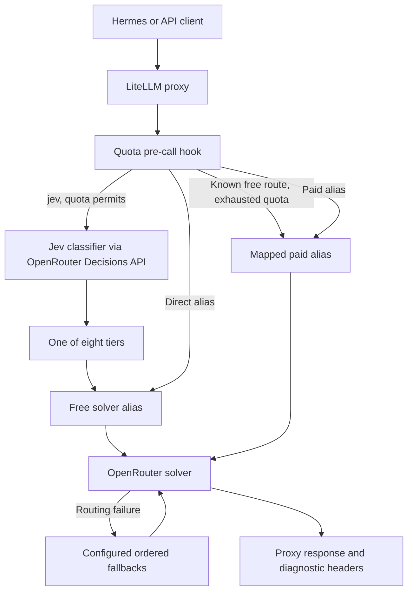

# Router architecture

Status: observed source design, 2026-09-20; deployment unverified.
Sources: [config](../raw/config.yaml), [classifier](../raw/jev_classifier.py),
[quota guard](../raw/openrouter_quota_guard.py).
Working copies: [router config](../router/config.yaml),
[classifier plugin](../router/jev_classifier.py), [quota plugin](../router/openrouter_quota_guard.py).

## Request path

This depicts intended integration based on the callback and config. Exact hook
ordering, fallback traversal, streaming behavior, and headers need verification
against the deployed LiteLLM version.

## Components and boundaries

| Component | Responsibility | Boundary |
|---|---|---|
| Client / Hermes | Sends messages and route alias | Hermes setup is absent from this import |
| LiteLLM proxy | Authentication, alias resolution, routing and fallback | External dependency; version not recorded |
| Jev plugin | Converts context into a classification request and validates the returned tier | Sends a selected transcript to OpenRouter |
| Quota plugin | Reads account free quota and rewrites known aliases | Process-local cached snapshot, not quota reservation |
| OpenRouter | Classification API and solver access | Availability, cost, and catalog are external state |
| Database | Configured via `DATABASE_URL`, with model storage enabled | No schema, instance, or migrations supplied |

`jev` is configured as `auto_router/complexity_router` with the plugin export
`jev_classifier.jev_classifier`. The quota callback is
`openrouter_quota_guard.proxy_handler_instance`. Both module files must be visible
to the proxy's Python import path. The config reads the proxy master key, database
URL, and provider key from environment variables.

The classifier only selects a tier. It does not solve the task. Specialized aliases
skip classification. Quota exhaustion on `jev` also skips classification by
rewriting it to `paid-general-capable`.

## Control and evidence paths

[Discovery](evaluation.md) calls OpenRouter directly to produce candidate rankings.
Health checks call the proxy to exercise configured aliases. Classifier benchmarks
compare classification responses using a separate labeled prompt suite.
None of these tools automatically applies recommendations to the router config.

The [wiki workflow](workflow.md) governs project changes, not runtime inference:
raw evidence is ingested, the design is documented, working files are changed, and
verification evidence is summarized back into the wiki.

Related: [routing](routing.md), [quota guard](quota-guard.md), [operations](operations.md).
