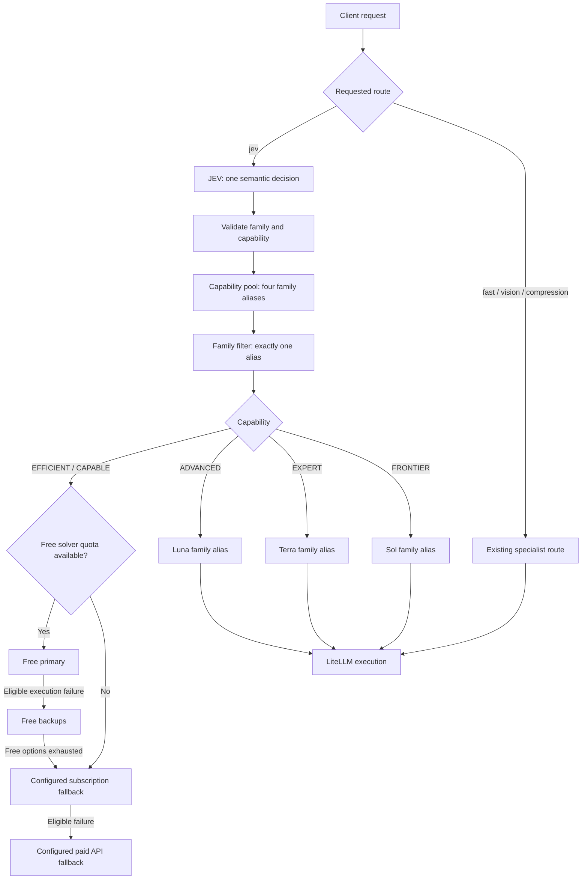

# Free-first JEV routing with subscription escalation

Status: implemented with offline tests on 2026-09-22; two independent acceptance reviews are clean. Live provider compatibility, quality and access remain unverified.
Source: [latest design note](../raw/notes/2026-09-22-free-first-escalation-design.md).

This is the current design reference. It replaces this page's earlier alternative
that preserved a pre-classification quota rewrite and prohibited failure escalation.
The working branch now implements this architecture in [the callback](../router/jev_router.py)
and [registry](../router/config.yaml).

## Responsibilities

| Component | Responsibility |
|---|---|
| JEV | One classification call producing family plus capability. Judge task content, not provider, authentication, subscription or price. |
| Semantic routing callback | Validate the decision, form its semantic class, select a capability pool and narrow it to exactly one matching family alias. Keep decision state local to the request. |
| Deployment registry | YAML alias-to-model/provider assignments, independently changeable without changing JEV semantics. |
| Quota policy | Determine which free solver attempts are available; select an eligible execution path without changing task classification. |
| LiteLLM | Resolve the chosen alias to a deployment, execute it and follow explicit fallback chains. |

The callback uses LiteLLM's supported proxy pre-call extension. It replaces the
built-in complexity Auto Router handoff for `jev`; it does not patch LiteLLM core.
Five capability levels are application policy, not five configured Auto Router
tiers. An application-invoked family filter may use the RoutingPlugin protocol,
but the installed Auto Router does not orchestrate that combined pipeline.
The [installed audit](../raw/notes/2026-09-22-five-tier-api-audit.md) and
[upstream research](../raw/notes/2026-09-22-upstream-five-tier-research.md) explain why.

## Implemented request flow



All solver boxes use LiteLLM execution; its retry/fallback mechanism is expanded
on the free-first branch to show priority. Each subscription alias falls back to its family paid-capable primary, backup,
and paid-emergency. Luna is the failure escalation target for lower levels;
transport failure never climbs from Luna to Terra or Sol. Local input rejection
happens before classification/execution. Other solver failures use pinned LiteLLM
fallback behavior, including upstream request/authentication errors; this is not
a quality evaluator or a custom error-specific retry engine.

Quota handling occurs outside JEV's semantic judgment. For a free-selected task,
known exhausted quota skips free solver attempts and follows subscription-before-
paid policy. The old `jev -> paid-general-capable` quota rewrite cannot simply
remain ahead of classification: it would bypass this policy and lose the family.
The callback implements and tests this order.
JEV itself uses an OpenRouter classifier endpoint; skipping free solver quota
checks does not imply that no OpenRouter request or classifier charge occurs.

## Semantic decision and alias mapping

One decision supplies both dimensions, for example:

```json
{"family": "CODING", "capability": "CAPABLE"}
```

Its semantic class is `CODING_CAPABLE`. This is an illustrative application result,
not a claim that the current Decisions API payload implements that object schema.
There must not be separate JEV calls for family and capability.

| Family | EFFICIENT | CAPABLE | ADVANCED | EXPERT | FRONTIER |
|---|---|---|---|---|---|
| GENERAL | GENERAL_EFFICIENT | GENERAL_CAPABLE | GENERAL_ADVANCED | GENERAL_EXPERT | GENERAL_FRONTIER |
| REASONING | REASONING_EFFICIENT | REASONING_CAPABLE | REASONING_ADVANCED | REASONING_EXPERT | REASONING_FRONTIER |
| AGENTIC | AGENTIC_EFFICIENT | AGENTIC_CAPABLE | AGENTIC_ADVANCED | AGENTIC_EXPERT | AGENTIC_FRONTIER |
| CODING | CODING_EFFICIENT | CODING_CAPABLE | CODING_ADVANCED | CODING_EXPERT | CODING_FRONTIER |

Lower levels keep `free-<family>-efficient` and `free-<family>-capable` aliases.
For higher levels, the convention is `<level>-<family>`, such as
`expert-coding`. This preserves the initial draft naming; family-first examples
from earlier discussion are conceptual equivalents, not additional aliases.
Only these aliases are registered.

The filter must only remove candidates, return exactly one alias and reject
unknown/missing family or capability safely. Client-provided decision metadata
must not override the server's JEV result. No cross-family candidate may survive.
A solver failure changes the execution path, not the semantic class: log both
`CODING_CAPABLE` and the actual subscription fallback separately.

## Primary models and configured roster

Model IDs below are inherited configuration or proposed initial assignments;
availability, model quality and subscription access have not been live verified.

| Family | EFFICIENT free primary | CAPABLE free primary |
|---|---|---|
| General | `poolside/laguna-s-2.1:free` | `deepseek/deepseek-v4-flash-0731:free` |
| Reasoning | `deepseek/deepseek-v4-flash-0731:free` | `deepseek/deepseek-v4-flash-0731:free` |
| Agentic | `nex-agi/nex-n2.5-mini:free` | `nex-agi/nex-n2.5-pro:free` |
| Coding | `nex-agi/nex-n2.5-mini:free` | `nex-agi/nex-n2.5-pro:free` |

These eight primary routes remain free; CAPABLE is not automatically ChatGPT.
Normal flow is free primary -> compatible free backups -> configured subscription
fallback -> compatible paid API fallback. Each lower-level family route and backup uses advanced-<family> (Luna) after
its original free attempts, before its original paid sequence.

| Role | Models / selectors |
|---|---|
| Classifier | `typesafe/jev-1.13` |
| Additional free backups | `google/gemma-4-31b-it:free`, `nvidia/nemotron-3-super-120b-a12b:free`; existing free primaries are also reused as backups |
| Free vision | `inclusionai/ling-3.0-flash-vl:free`, `google/gemma-4-26b-a4b-it:free` |
| ADVANCED direct selection | `chatgpt/gpt-5.6-luna` behind a family alias |
| EXPERT direct selection | `chatgpt/gpt-5.6-terra` behind a family alias |
| FRONTIER direct selection | `chatgpt/gpt-5.6-sol` behind a family alias |
| Final paid API pool | Paid Laguna S 2.1, DeepSeek V4 Flash 0731, Gemma 4 31B IT, Nemotron 3 Super 120B A12B, Gemma 4 26B A4B IT, and `thinkingmachines/inkling-small` |
| Emergency selectors | OpenRouter Free and OpenRouter Auto; these do not identify fixed solver models |

Non-ChatGPT solver IDs above use the `openrouter/` provider prefix in YAML.
Fast, vision and compression retain existing specialist entrypoints and policies;
subscription fallbacks for them require separate modality/context compatibility
checks. Generic emergency selection does not prove capability or family suitability.
Paid API routes are the last proposed resort; this design does not guarantee zero
API spend or supply spending limits. Free-first also does not make JEV free.

## Examples

```text
Straightforward implementation
  -> JEV: CODING_CAPABLE
  -> free-coding-capable -> Nex N2.5 Pro free
  -> eligible failure: compatible free backups
  -> no usable free option: configured subscription fallback
  -> eligible failure: configured paid API fallback

Exceptionally difficult distributed-state diagnosis requiring code changes
  -> JEV: CODING_EXPERT
  -> expert-coding -> Terra
```

Examples express routing intent, not verified classifier accuracy. Preserve the
original EFFICIENT/CAPABLE wording; calibrate boundaries for direct higher-level
selection with labeled cases so ordinary difficult work does not overuse ChatGPT.

## Changes from earlier policy

- Failure escalation to ChatGPT is now intentional; the earlier prohibition is
  superseded by the user's free-first correction.
- Existing free primaries remain. The suggestion to make all CAPABLE primaries
  subscription models is discarded.
- Fallback chains must change to insert subscription before paid API attempts;
  do not claim they remain behaviorally identical. Preserve unaffected ordering
  and specialist paths, and document each intentional difference.
- A callback rewrite changes the fallback root captured by LiteLLM. Compare actual
  baseline and target failure traces rather than relying only on YAML equality.
- The older twenty-tier YAML and failed five-tier-plugin design remain historical
  evidence, not the implementation of this proposal.

## Implementation boundaries and verification

The proxy callback supports `completion` and `acompletion` with nonempty text
messages. Multimodal and tool-call message bodies are outside this first semantic
entrypoint; use explicit routes for those. Client deployment, endpoint, fallback,
retry and per-request router overrides are rejected on `jev`. Client decision
metadata is overwritten and never supplied to JEV. One Decisions API choice is
parsed into the immutable structured decision; there is no second classifier call.

A local custom provider guards `jev` when the callback is missing, with no fallback
chain on that placeholder. Import the repository root on PYTHONPATH; SDK callers
must run the callback before Router execution. Target and fallback model permissions
are checked using the installed proxy authorization helper. Target model-level
guardrails fail closed because this callback cannot replay the earlier pre-call
guardrail stage safely. Keys granting only `jev` need access to all possible
selected/fallback aliases. No family state is stored on a shared callback.

Unknown/stale quota is fail-open by default; `OPENROUTER_QUOTA_FAIL_OPEN=false`
rejects it with 503. Known exhausted quota uses the configured route/block policy.
Direct specialist routes retain their original quota rewrites. JEV failures use
the existing lower-level fail tier, normally GENERAL_CAPABLE; cancellation propagates.

For classified requests and direct family aliases (including free backups), the
callback passes a root-only fallback list to LiteLLM,
so nested alias chains cannot reorder the original sequence. No application retry
loop is added; configured num_retries remains zero. Paid API fallback is enabled;
strict cost controls remain separate on `codex/cost-aware-router`.

Offline evidence: [callback tests](../tools/test_callback_routing.py) exercise
all twenty concurrent decisions, candidate narrowing, invalid decisions, missing
callback, actual proxy callback type, request overrides, access rejection, quota,
and real Router failure traces with fake providers/HTTP. [Registry regression
checks](../tools/test_twenty_tiers.py) preserve original eight criteria/CAPABLE
wording, all original solver assignments and specialist fallback lists.
[API probes](../tools/test_routing_signal_api.py) retain the historical blockers;
they are not the callback acceptance tests.

Two clean independent reviews and 21 passing tests are recorded in the
[acceptance receipt](../raw/notes/2026-09-22-callback-acceptance.md). OAuth/login, deployment,
streaming validation, model accuracy, live subscription model names and availability
remain unverified and are not performed by this work. The pinned offline dependency
set is in [requirements](../requirements.txt); it is not a deployment lockfile.
